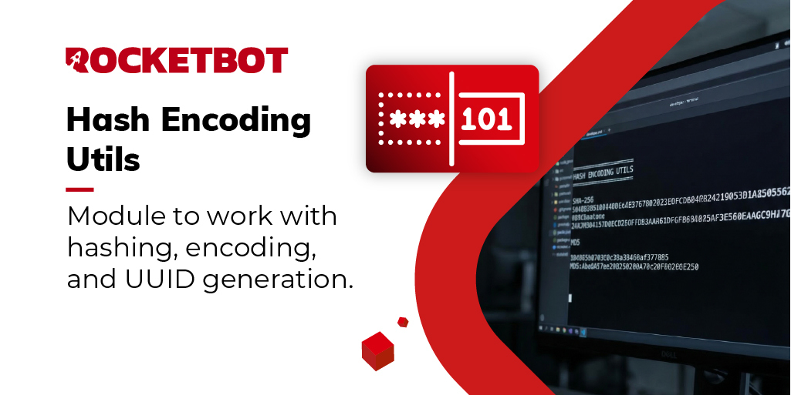

# Hash Encoding Utils

Módulo para trabajar con hashes, codificación de texto y generación de UUID

*Read this in other languages: [English](Manual_HashEncodingUtils.md), [Português](Manual_HashEncodingUtils.pr.md), [Español](Manual_HashEncodingUtils.es.md)*

## Como instalar este módulo

Para instalar el módulo en Rocketbot Studio, se puede hacer de dos formas:
1. Manual: __Descargar__ el archivo .zip y descomprimirlo en la carpeta modules. El nombre de la carpeta debe ser el mismo al del módulo y dentro debe tener los siguientes archivos y carpetas: \__init__.py, package.json, docs, example y libs. Si tiene abierta la aplicación, refresca el navegador para poder utilizar el nuevo modulo.
2. Automática: Al ingresar a Rocketbot Studio sobre el margen derecho encontrara la sección de **Addons**, seleccionar **Install Mods**, buscar el modulo deseado y presionar install.

## Descripción de los comandos

### Generate Hash

Genera un valor hash a partir de un texto de entrada.
|Parámetros|Descripción|ejemplo|
| --- | --- | --- |
|Algoritmo|Seleccione el algoritmo de hash|Seleccione|
|Texto|Texto de entrada para generar el hash|Text|
|Asignar resultado a Variable|Variable donde se almacenará el resultado|Variable|

### Encode/Decode Base64

Codifica o decodifica texto en formato Base64.
|Parámetros|Descripción|ejemplo|
| --- | --- | --- |
|Operación|Seleccione codificar o decodificar||
|Texto|Texto de entrada|Text|
|Asignar resultado a Variable|Variable donde se almacenará el resultado|Variable|

### Encode/Decode URL

Codifica o decodifica texto de URL.
|Parámetros|Descripción|ejemplo|
| --- | --- | --- |
|Operación|Seleccione codificar o decodificar||
|Texto|Texto de entrada|Text|
|Asignar resultado a Variable|Variable donde se almacenará el resultado|Variable|

### Generate UUID

Genera un valor UUID único.
|Parámetros|Descripción|ejemplo|
| --- | --- | --- |
|Asignar resultado a Variable|Variable donde se almacenará el UUID|Variable|
